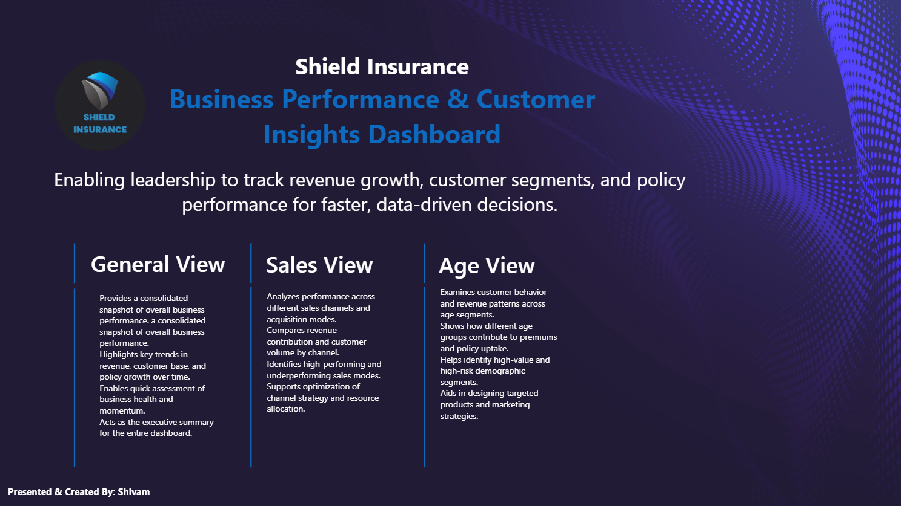
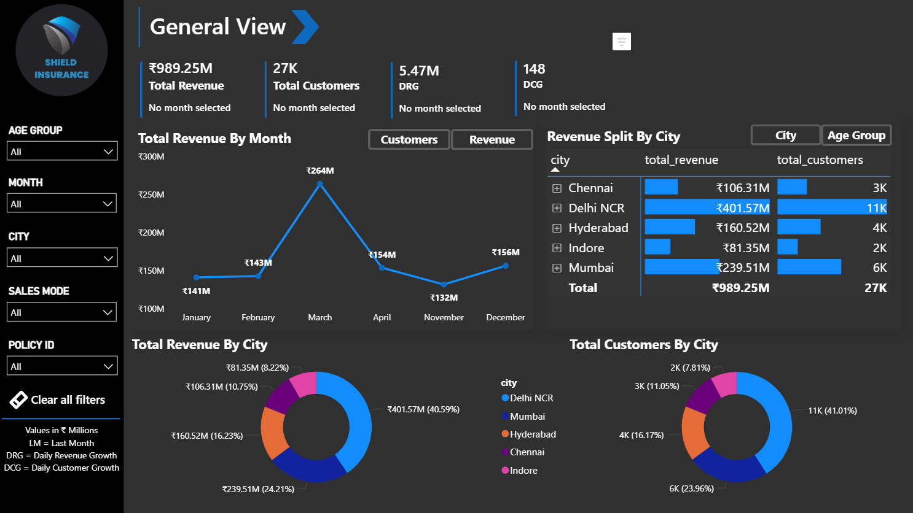
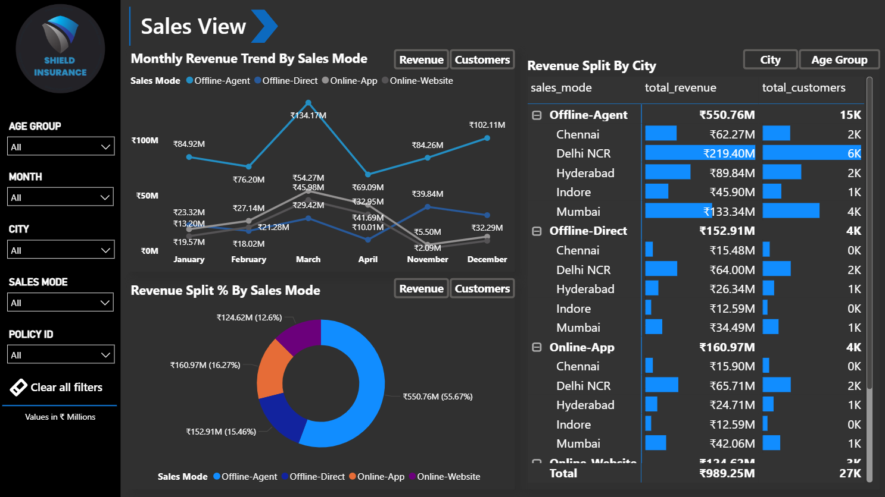
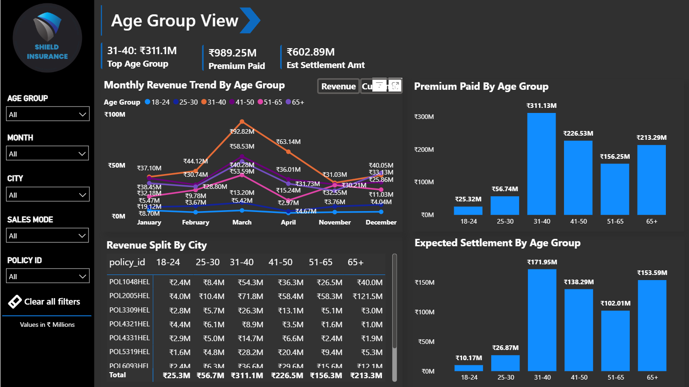

# Shield Insurance Analysis Dashboard

## Project Overview
This project analyzes insurance business performance using Power BI.  
The dashboard provides insights into revenue trends, customer demographics, sales channels, and risk exposure, enabling stakeholders to monitor performance and make data-driven decisions.

---

## Live Dashboard

🔗 [Open Interactive Power BI Dashboard](https://app.powerbi.com/view?r=eyJrIjoiZjVkZWYzMGYtMzE1ZC00MTAwLTk2MmUtYThlOTJjOWRmNjU2IiwidCI6ImM2ZTU0OWIzLTVmNDUtNDAzMi1hYWU5LWQ0MjQ0ZGM1YjJjNCJ9)

---

## Dashboard Preview

### Dashboard Overview

### General View

### Sales View

### Age Group View

---

## Business Objectives

**1.** Analyze insurance revenue performance across different sales channels.  

**2.** Identify high-risk customer segments using claims and settlement analysis.  

**3.** Track key insurance KPIs such as premium growth, settlement ratios, and policy distribution.

---

## Dashboard Insights

- Revenue performance by sales channel  
- Customer demographic distribution  
- Claim settlement ratio analysis  
- Risk exposure by customer segment  
- Premium growth trends over time  

These insights help stakeholders monitor policy performance and identify opportunities to optimize insurance sales strategies.

---

## Tools & Technologies

- Power BI  
- DAX  
- SQL  
- Data Modeling  
- Data Visualization  

---

## Technical Skills Demonstrated

- [x] Data modeling using star schema  
- [x] Creation of 15+ DAX measures for KPI calculations  
- [x] Premium growth and settlement ratio calculations  
- [x] Interactive dashboard development in Power BI  
- [x] Data cleaning and transformation using SQL  

---

## Business Value

- Enabled stakeholders to monitor insurance revenue trends  
- Identified high-risk customer segments  
- Highlighted top-performing sales channels  
- Improved reporting efficiency through automated dashboards
